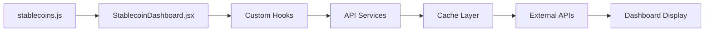

# Stablecoin Exposure Limits Dashboard

    

**Stablecoin Exposure Limits Dashboard** is a specialized risk monitoring platform for Inverse Finance that tracks stablecoin exposure metrics across supply, liquidity, lending markets, and safety buffers. This dashboard provides real-time insights into stablecoin risk parameters to support informed decision-making for protocol risk management.

## 🎯 Key Features

This dashboard provides comprehensive stablecoin risk monitoring capabilities:

- 📊 **Supply Metrics**: Total supply, bridge-secured supply, mainnet supply tracking
- 💧 **Liquidity Monitoring**: DEX liquidity across Curve, Balancer, Uniswap, and Sushiswap
- 🏦 **Lending Market Analysis**: Collateral usage in Aave, Morpho, Euler, and Fluid (including Pendle PT markets)
- 🛡️ **Safety Buffer Assessment**: Insurance funds, collateralization ratios, and safety factors
- 🎯 **Risk Scoring**: Automated Factor of Safety calculation and Theoretical Supply Limit estimation
- 👨‍💼 **Operator Mode**: Manual data entry interface for bridge supply and collateralization ratio
- 📈 **Real-time Data**: Live metrics from multiple blockchain and DeFi data sources
- 📥 **CSV Export**: Export complete metrics or detailed breakdowns for offline analysis
- 📱 **Responsive Design**: Optimized for desktop and mobile viewing

## 📁 Project Structure

```
inverse-stablecoin-exposure/
├── src/
│   ├── config/
│   │   ├── stablecoins.js        # 🔧 MAIN STABLECOIN CONFIGURATION
│   │   └── manualDefaults.js     # Manual data entry defaults
│   ├── components/
│   │   ├── StablecoinDashboard.jsx # 🎛️ Main dashboard component
│   │   ├── OperatorDataEntry.jsx # Manual data entry modal
│   │   ├── DataSourceBadge.jsx   # Data source indicators
│   │   ├── Header.jsx            # Navigation header with Inverse Finance branding
│   │   └── Footer.jsx            # Footer component
│   ├── hooks/                    # Data fetching hooks
│   │   ├── useStablecoinMetrics.js # Complete stablecoin metrics
│   │   ├── useCoinGecko.js       # Market data integration
│   │   ├── useUniswap.js         # DEX liquidity data
│   │   ├── useCurve.js           # Curve pool data
│   │   ├── useBalancer.js        # Balancer pool data
│   │   ├── useSushiSwap.js       # SushiSwap pool data
│   │   ├── useLendingMetrics.js  # Lending protocol data
│   │   └── useEthereum.js        # On-chain supply data
│   ├── utils/
│   │   ├── stablecoinMetricHelpers.js # Metric calculation utilities
│   │   └── stablecoinCsvExport.js     # CSV export functionality
│   ├── services/
│   │   └── cache-client.js       # Caching and API management
│   └── assets/                   # Static assets
├── cache-service/                # Backend caching service
├── public/                       # Public assets
├── dist/                         # Production build
├── .github/                      # GitHub workflows
├── docker-compose.yml            # Docker setup
├── Dockerfile                    # Container configuration
└── package.json                  # Dependencies and scripts
```

## 🔧 Core Configuration Files

### 1. `src/config/stablecoins.js` - Stablecoin Configuration

This is the **main configuration file** for tracked stablecoins:

```javascript
export const stablecoins = [
  {
    name: "USDS + DAI",               // Display name
    symbol: "USDS_DAI",               // Unique identifier
    coingeckoIds: ["dai", "usds"],    // CoinGecko API IDs
    contractAddresses: {              // Contract addresses
      dai: "0x6b175474e89094c44da98b954eedeac495271d0f",
      usds: "0xdC035D45d973E3EC169d2276DDab16f1e407384F"
    },
    stakedCoingeckoIds: ["susds"],    // Staked version IDs
    stakedContractAddresses: {        // Staked token contracts
      susds: "0xa3931d71877c0e7a3148cb7eb4463524fec27fbd"
    },
    insuranceFund: {                  // Insurance fund configuration
      monitoredAddresses: [],
      tokensToMonitor: [],
      lpTokensToMonitor: []
    },
    manualDataSources: {              // Manual data entry sources
      bridgeSupply: [
        { url: "https://...", description: "Bridge data" }
      ],
      collateralizationRatio: [
        { url: "https://...", description: "CR data" }
      ]
    },
    category: "sky"                   // Categorization
  },
  // Add more stablecoins here...
];
```

### 2. `src/components/StablecoinDashboard.jsx` - Dashboard Logic

The main dashboard component that displays the stablecoin metrics table:

- **Metrics Display**: Shows supply, liquidity, lending, and safety metrics
- **Real-time Updates**: Fetches live data from multiple sources
- **Manual Data Entry**: Operator interface for bridge supply and collateralization ratio
- **Sequential Loading**: Stablecoins load one at a time with progress indicator
- **Responsive Design**: Optimized table layout for all screen sizes
- **Data Visualization**: Color-coded sections for different metric categories
- **CSV Export**: Export metrics to CSV for further analysis

## 🚀 Quick Start

### Prerequisites

- Docker and Docker Compose
- Git

### Installation

```bash
# Clone the repository
git clone https://github.com/naouflex/inverse-stablecoin-exposure.git
cd inverse-stablecoin-exposure

# Create environment file
cp .env.example .env
# Edit .env with your API keys and configuration

# Start development environment
./scripts/dev.sh
```

The dashboard will be available at `http://localhost:3000`

### Dashboard Structure

The dashboard uses a **metrics-as-rows, stablecoins-as-columns** layout for easy comparison:

**📊 Columns (8 Stablecoins):**
- **USDS + DAI** - Maker ecosystem
- **USDe** - Ethena synthetic dollar  
- **USR** - Real world asset-backed
- **deUSD** - Decentralized USD
- **crvUSD** - Curve ecosystem
- **USDO** - Omnichain stablecoin
- **fxUSD** - f(x) Protocol
- **reUSD** - Reserve Protocol

**📈 Rows (4 Metric Sections):**

1. **Supply Metrics** (Blue)
   - Total Supply
   - Supply secured by bridge (manual entry)
   - Mainnet Supply
   - Excl. lending markets, other networks (calculated)

2. **Mainnet Liquidity** (Green)
   - Curve, Balancer, Uniswap, Sushiswap
   - Total mainnet liquidity (sum)

3. **Competitor Markets** (Purple)
   - Aave, Morpho, Euler, Fluid Collateral
   - Total lending markets (sum with Pendle PT breakdown)

4. **Safety Buffer** (Red)
   - Insurance Layer/Fund
   - Collateralization Ratio (manual entry)
   - Staked Supply
   - % Supply on Mainnet (calculated)
   - Factor of Safety (calculated composite risk score)
   - Theoretical Supply Limit (calculated risk-adjusted limit)

## 📊 Data Sources

The dashboard integrates with multiple APIs to provide comprehensive stablecoin metrics:

| Data Source | Usage | Metrics Provided |
|------------|-------|------------------|
| **Ethereum RPC** | On-chain data | Total supply, mainnet supply, token balances |
| **CoinGecko API** | Market data | Stablecoin prices and basic market information |
| **Curve API** | DEX liquidity | Curve pool TVL and trading volumes |
| **Uniswap Subgraph** | DEX liquidity | Uniswap pool TVL and liquidity metrics |
| **Balancer Subgraph** | DEX liquidity | Balancer pool TVL and trading data |
| **SushiSwap Subgraph** | DEX liquidity | SushiSwap pool TVL and volume data |
| **Aave Protocol** | Lending markets | Collateral usage and lending metrics |
| **Morpho Protocol** | Lending markets | Advanced lending market data |
| **Euler Finance** | Lending markets | Euler lending protocol metrics |
| **Fluid Protocol** | Lending markets | Fluid lending market usage |
| **Bridge APIs** | Cross-chain data | Bridge-secured supply tracking |
| **Protocol APIs** | Safety metrics | Insurance funds, CR, staking data |

## 🎨 Customization Examples

### Adding a New Stablecoin

1. **Add the stablecoin configuration** in `stablecoins.js`:
```javascript
{
  name: "Your Stablecoin",
  symbol: "YSTABLE",
  coingeckoIds: ["your-stablecoin-id"],
  contractAddresses: {
    token: "0x..."
  },
  stakedCoingeckoIds: ["staked-version"],
  stakedContractAddresses: {
    staked: "0x..."
  },
  insuranceFund: {
    monitoredAddresses: [],
    tokensToMonitor: [],
    lpTokensToMonitor: []
  },
  manualDataSources: {
    bridgeSupply: [
      {
        url: "https://...",
        description: "Data source"
      }
    ],
    collateralizationRatio: [
      {
        url: "https://...",
        description: "CR data source"
      }
    ]
  },
  category: "your_category"
}
```

2. The stablecoin will automatically appear as a new column in the dashboard.

### Adding a New Metric Row

1. **Add the metric case** in `StablecoinDashboard.jsx` `MetricRow` component:
```javascript
case 'yourNewMetric':
  return metrics.yourNewMetric?.isLoading ? <Skeleton height="20px" /> : 
    <Text fontSize="sm">{formatStablecoinAmount(metrics.yourNewMetric?.data || 0)}</Text>;
```

2. **Add the MetricRow** to the appropriate section in the dashboard:
```jsx
<MetricRow 
  metricKey="yourNewMetric" 
  metricLabel="Your New Metric" 
  sectionColor="blue.500"
  allStablecoinMetrics={allStablecoinMetrics}
  loadedStablecoins={loadedStablecoins}
  openOperatorModal={openOperatorModal}
/>
```

### Customizing Manual Data Entry

Update manual data defaults in `manualDefaults.js`:

```javascript
export const manualDataDefaults = {
  YSTABLE: {
    bridgeSupply: 1000000,
    collateralizationRatio: 1.05
  }
};
```

## 🐳 Docker Deployment

The Stablecoin Exposure Dashboard provides separate Docker configurations for development and production environments.

### 🛠️ Development Environment

For local development with external Redis and API proxy:

```bash
# Option 1: Use helper script (recommended)
./scripts/dev.sh

# Option 2: Manual setup
docker-compose -f docker-compose.dev.yml up -d --build
```

**Development Environment Features:**
- Uses `Dockerfile.dev` and `nginx.dev.conf`
- Nginx proxy routes API calls to cache-service
- External Redis connection
- Accessible at: http://localhost:3000
- API Health: http://localhost:3000/api/health

### 🚀 Production Environment

For production deployment (e.g., Digital Ocean App Platform):

```bash
# Option 1: Use helper script (recommended)
./scripts/prod.sh

# Option 2: Manual setup
docker-compose up -d --build
```

**Production Environment Features:**
- Uses `Dockerfile` and `nginx.conf`
- API routing handled by platform (Digital Ocean App Platform)
- External Redis connection
- Optimized for production deployment

### 📋 Environment Variables

Create a `.env` file in the root directory:

```env
# Cache Service Configuration
PORT=4000
REDIS_URL=redis://your-redis-host:6379

# API Keys (secure backend-only)
COINGECKO_API_KEY=your_coingecko_api_key
THE_GRAPH_API_KEY=your_thegraph_api_key

# Ethereum RPC URLs
ETH_RPC_URL=https://mainnet.infura.io/v3/your_key
ETH_RPC_URL_FALLBACK=https://rpc.ankr.com/eth

# The Graph Subgraph IDs
UNISWAP_V3_SUBGRAPH_ID=5zvR82QoaXuFYDNKBfRU5N3q
UNISWAP_V2_SUBGRAPH_ID=ELUcwgpm14LKPLrBRuVvPvNKHQ9HvwmtKgKSH6123456
SUSHI_SUBGRAPH_ID=4bb7e6e1-b60d-4e1e-9f0d-123456789abc
SUSHI_V2_SUBGRAPH_ID=0x4bb7e6e1-b60d-4e1e-9f0d-123456789abc
CURVE_SUBGRAPH_ID=3C5-qE3-wVf-6Pw-dS2-aB8-x9K-mN4
FRAXSWAP_SUBGRAPH_ID=8H2-nF9-sW3-7Qs-eR5-cD6-y1L-mK8
BALANCER_V2_SUBGRAPH_ID=C4ayEZP2yTXRAB8Tf0h8bKaLqr
```

### 🔧 Service Architecture

```
┌─────────────────┐    ┌─────────────────┐    ┌─────────────────┐
│   Frontend      │    │  Cache Service  │    │  External APIs  │
│   (React/Vite)  │◄──►│   (Node.js)     │◄──►│   (CoinGecko,   │
│   Port: 3000    │    │   Port: 4000    │    │   DeFiLlama,    │
└─────────────────┘    └─────────────────┘    │   The Graph)    │
         │                       │             └─────────────────┘
         ▼                       ▼
┌─────────────────┐    ┌─────────────────┐
│     Nginx       │    │      Redis      │
│   (Proxy/CDN)   │    │     (Cache)     │
└─────────────────┘    └─────────────────┘
```

### 📊 Health Checks

Monitor your deployment:

```bash
# Check application status
curl http://localhost:3000/api/health

# Check Redis connection
curl http://localhost:3000/api/admin/redis-info

# View container logs
docker-compose logs -f app
docker-compose logs -f cache-service
```

### 🔄 Updating Deployment

```bash
# Pull latest changes
git pull origin main

# Rebuild and restart (development)
docker-compose -f docker-compose.dev.yml down
./scripts/dev.sh

# Rebuild and restart (production)
docker-compose down
./scripts/prod.sh
```

## 🔄 Data Flow



1. **Configuration** loaded from `stablecoins.js`
2. **Dashboard component** processes stablecoin list
3. **Custom hooks** fetch data for each stablecoin
4. **Cache service** optimizes API calls
5. **External APIs** provide real-time data
6. **UI components** display formatted results

## 🛠️ Advanced Customization

### Custom Data Sources

Add your own data sources by creating new hooks:

```javascript
// src/hooks/useCustomStablecoinMetric.js
export function useCustomStablecoinMetric(stablecoin, options = {}) {
  return useQuery({
    queryKey: ['customMetric', stablecoin.symbol],
    queryFn: () => fetchCustomStablecoinData(stablecoin),
    ...options
  });
}
```


### Custom Styling

Modify themes in the main app or component files:

```javascript
const customTheme = {
  colors: {
    brand: {
      primary: '#your-color',
      secondary: '#your-color'
    }
  }
};
```

## 📈 Performance Optimization

- **Sequential Loading**: Stablecoins load one by one to prevent API rate limits and ensure stable data fetching
- **Caching Layer**: Reduces redundant API calls with intelligent caching via Redis
- **Lazy Loading**: Metrics load only when their stablecoin column is enabled
- **Memoization**: Expensive calculations (Factor of Safety, Theoretical Supply Limit) are cached
- **Efficient Rendering**: Skeleton loaders prevent layout shifts during data fetching

## 🤝 Contributing

We welcome contributions! This project thrives on community involvement:

1. **Fork** the repository
2. **Create** a feature branch (`git checkout -b feature/amazing-feature`)
3. **Commit** your changes (`git commit -m 'Add amazing feature'`)
4. **Push** to the branch (`git push origin feature/amazing-feature`)
5. **Open** a Pull Request

### Contribution Ideas
- 📊 **Additional metrics** (peg stability tracking, redemption mechanisms, yield rates)
- 🏦 **New stablecoins** (add support for emerging stablecoin protocols)
- 🎨 **UI improvements** (time-series charts, risk score visualizations, mobile optimization)
- 🔌 **API integrations** (additional lending protocols, L2 bridge data, real-time monitoring)
- 🧪 **Testing** (unit tests, integration tests, data validation)
- 📝 **Documentation** (operator guides, metric calculation explanations)

## 🆘 Support & Community

- **Issues**: [GitHub Issues](https://github.com/naouflex/inverse-stablecoin-exposure/issues)
- **Discussions**: [GitHub Discussions](https://github.com/naouflex/inverse-stablecoin-exposure/discussions)
- **Documentation**: This README and inline code comments
- **Configuration**: See `src/config/stablecoins.js` and `src/config/manualDefaults.js` for examples


---
*This project is maintained by the community for the community. Star ⭐ the repo if you find it useful!*

