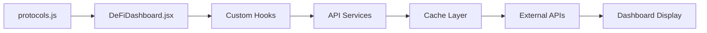

# Stablecoin Exposure Limits Dashboard

    

**Stablecoin Exposure Limits Dashboard** is a specialized risk monitoring platform for Inverse Finance that tracks stablecoin exposure metrics across supply, liquidity, lending markets, and safety buffers. This dashboard provides real-time insights into stablecoin risk parameters to support informed decision-making for protocol risk management.

## 🎯 Key Features

This dashboard provides comprehensive stablecoin risk monitoring capabilities:

- 📊 **Supply Metrics**: Total supply, bridge-secured supply, mainnet supply tracking
- 💧 **Liquidity Monitoring**: DEX liquidity across Curve, Balancer, Uniswap, and Sushiswap
- 🏦 **Lending Market Analysis**: Collateral usage in Aave, Morpho, Euler, and Fluid
- 🛡️ **Safety Buffer Assessment**: Insurance funds, collateralization ratios, and safety factors
- 📈 **Real-time Data**: Live metrics from multiple blockchain and DeFi data sources
- 📱 **Responsive Design**: Optimized for desktop and mobile viewing

## 📁 Project Structure

```
stablecoin-exposure-dashboard/
├── src/
│   ├── config/
│   │   └── stablecoins.js        # 🔧 MAIN STABLECOIN CONFIGURATION
│   ├── components/
│   │   ├── StablecoinDashboard.jsx # 🎛️ Main dashboard component
│   │   ├── Header.jsx            # Navigation header with Inverse Finance branding
│   │   └── Footer.jsx            # Footer component
│   ├── hooks/                    # Data fetching hooks
│   │   ├── useStablecoinMetrics.js # Stablecoin-specific data hooks
│   │   ├── useCoinGecko.js       # Market data integration
│   │   ├── useUniswap.js         # DEX liquidity data
│   │   ├── useCurve.js           # Curve pool data
│   │   ├── useBalancer.js        # Balancer pool data
│   │   ├── useSushiSwap.js       # SushiSwap pool data
│   │   └── useEthereum.js        # On-chain supply data
│   ├── services/
│   │   └── cache-client.js       # Caching and API management
│   └── assets/                   # Static assets
├── cache-service/                # Backend caching service
├── public/                       # Public assets
├── dist/                         # Production build
├── .github/                      # GitHub workflows
├── docker-compose.yml            # Docker setup
├── Dockerfile                    # Container configuration
└── package.json                  # Dependencies and scripts
```

## 🔧 Core Configuration Files

### 1. `src/config/stablecoins.js` - Stablecoin Configuration

This is the **main configuration file** for tracked stablecoins:

```javascript
export const stablecoins = [
  {
    name: "USDS + DAI",               // Display name
    symbol: "USDS_DAI",               // Unique identifier
    coingeckoIds: ["dai", "usds"],    // CoinGecko API IDs
    contractAddresses: {              // Contract addresses
      dai: "0x6b175474e89094c44da98b954eedeac495271d0f",
      usds: "0xdC035D45d973E3EC169d2276DDab16f1e407384F"
    },
    category: "maker_ecosystem"       // Categorization
  },
  // Add more stablecoins here...
];
```

### 2. `src/components/StablecoinDashboard.jsx` - Dashboard Logic

The main dashboard component that displays the stablecoin metrics table:

- **Metrics Display**: Shows supply, liquidity, lending, and safety metrics
- **Real-time Updates**: Fetches live data from multiple sources
- **Responsive Design**: Optimized table layout for all screen sizes
- **Data Visualization**: Color-coded sections for different metric categories

## 🚀 Quick Start

### Prerequisites

- Docker and Docker Compose
- Git

### Installation

```bash
# Clone the repository
git clone https://github.com/your-username/open-dashboard.git
cd open-dashboard

# Create environment file
cp .env.example .env
# Edit .env with your API keys and configuration

# Start development environment
./scripts/dev.sh
```

The dashboard will be available at `http://localhost:3000`

### Monitored Stablecoins

The dashboard currently tracks the following stablecoins:

1. **USDS + DAI** - Maker ecosystem stablecoins
2. **USDe** - Ethena synthetic dollar
3. **USR** - Real world asset-backed stablecoin
4. **deUSD** - Decentralized USD
5. **crvUSD** - Curve ecosystem stablecoin
6. **USDO** - Omnichain stablecoin
7. **fxUSD** - f(x) Protocol stablecoin
8. **reUSD** - Reserve Protocol stablecoin

Each stablecoin is monitored across four key metric categories with real-time data updates.

## 📊 Data Sources

The dashboard integrates with multiple APIs to provide comprehensive stablecoin metrics:

| Data Source | Usage | Metrics Provided |
|------------|-------|------------------|
| **Ethereum RPC** | On-chain data | Total supply, mainnet supply, token balances |
| **CoinGecko API** | Market data | Stablecoin prices and basic market information |
| **Curve API** | DEX liquidity | Curve pool TVL and trading volumes |
| **Uniswap Subgraph** | DEX liquidity | Uniswap pool TVL and liquidity metrics |
| **Balancer Subgraph** | DEX liquidity | Balancer pool TVL and trading data |
| **SushiSwap Subgraph** | DEX liquidity | SushiSwap pool TVL and volume data |
| **Aave Protocol** | Lending markets | Collateral usage and lending metrics |
| **Morpho Protocol** | Lending markets | Advanced lending market data |
| **Euler Finance** | Lending markets | Euler lending protocol metrics |
| **Fluid Protocol** | Lending markets | Fluid lending market usage |
| **Bridge APIs** | Cross-chain data | Bridge-secured supply tracking |
| **Protocol APIs** | Safety metrics | Insurance funds, CR, staking data |

## 🎨 Customization Examples

### Adding a New Metric Column

1. **Extend the protocol data structure** in `protocols.js`:
```javascript
{
  // ... existing fields
  customMetric: 1000000,  // Your new field
}
```

2. **Add the column header** in `DeFiDashboard.jsx`:
```jsx
<SortableHeader 
  column="customMetric" 
  currentSort={sortConfig} 
  onSort={handleSort} 
  dataSource="Custom"
>
  Your Metric
</SortableHeader>
```

3. **Add the data cell** in the `ProtocolRow` component:
```jsx
<Td>
  <Text fontSize="sm">{protocol.customMetric}</Text>
</Td>
```

### Modifying Color Thresholds

Update the `getColorForMetric` function in `DeFiDashboard.jsx`:

```javascript
case 'yourMetric':
  return getColorScale(value, { 
    low: 10,      // Red threshold
    medium: 50,   // Yellow threshold  
    high: 100     // Green threshold
  }, false);      // false = higher is better
```

### Adding Protocol-Specific Logic

Handle special cases for specific protocols:

```javascript
// Special handling for your protocol
if (protocol.ticker === 'MYTOKEN') {
  // Custom calculation logic
  const customValue = (marketCap * specialMultiplier) / totalSupply;
  // Use in your metrics
}
```

## 🐳 Docker Deployment

The Open Dashboard provides separate Docker configurations for development and production environments.

### 🛠️ Development Environment

For local development with external Redis and API proxy:

```bash
# Option 1: Use helper script (recommended)
./scripts/dev.sh

# Option 2: Manual setup
docker-compose -f docker-compose.dev.yml up -d --build
```

**Development Environment Features:**
- Uses `Dockerfile.dev` and `nginx.dev.conf`
- Nginx proxy routes API calls to cache-service
- External Redis connection
- Accessible at: http://localhost:3000
- API Health: http://localhost:3000/api/health

### 🚀 Production Environment

For production deployment (e.g., Digital Ocean App Platform):

```bash
# Option 1: Use helper script (recommended)
./scripts/prod.sh

# Option 2: Manual setup
docker-compose up -d --build
```

**Production Environment Features:**
- Uses `Dockerfile` and `nginx.conf`
- API routing handled by platform (Digital Ocean App Platform)
- External Redis connection
- Optimized for production deployment

### 📋 Environment Variables

Create a `.env` file in the root directory:

```env
# Cache Service Configuration
PORT=4000
REDIS_URL=redis://your-redis-host:6379

# API Keys (secure backend-only)
COINGECKO_API_KEY=your_coingecko_api_key
THE_GRAPH_API_KEY=your_thegraph_api_key

# Ethereum RPC URLs
ETH_RPC_URL=https://mainnet.infura.io/v3/your_key
ETH_RPC_URL_FALLBACK=https://rpc.ankr.com/eth

# The Graph Subgraph IDs
UNISWAP_V3_SUBGRAPH_ID=5zvR82QoaXuFYDNKBfRU5N3q
UNISWAP_V2_SUBGRAPH_ID=ELUcwgpm14LKPLrBRuVvPvNKHQ9HvwmtKgKSH6123456
SUSHI_SUBGRAPH_ID=4bb7e6e1-b60d-4e1e-9f0d-123456789abc
SUSHI_V2_SUBGRAPH_ID=0x4bb7e6e1-b60d-4e1e-9f0d-123456789abc
CURVE_SUBGRAPH_ID=3C5-qE3-wVf-6Pw-dS2-aB8-x9K-mN4
FRAXSWAP_SUBGRAPH_ID=8H2-nF9-sW3-7Qs-eR5-cD6-y1L-mK8
BALANCER_V2_SUBGRAPH_ID=C4ayEZP2yTXRAB8Tf0h8bKaLqr
```

### 🔧 Service Architecture

```
┌─────────────────┐    ┌─────────────────┐    ┌─────────────────┐
│   Frontend      │    │  Cache Service  │    │  External APIs  │
│   (React/Vite)  │◄──►│   (Node.js)     │◄──►│   (CoinGecko,   │
│   Port: 3000    │    │   Port: 4000    │    │   DeFiLlama,    │
└─────────────────┘    └─────────────────┘    │   The Graph)    │
         │                       │             └─────────────────┘
         ▼                       ▼
┌─────────────────┐    ┌─────────────────┐
│     Nginx       │    │      Redis      │
│   (Proxy/CDN)   │    │     (Cache)     │
└─────────────────┘    └─────────────────┘
```

### 📊 Health Checks

Monitor your deployment:

```bash
# Check application status
curl http://localhost:3000/api/health

# Check Redis connection
curl http://localhost:3000/api/admin/redis-info

# View container logs
docker-compose logs -f app
docker-compose logs -f cache-service
```

### 🔄 Updating Deployment

```bash
# Pull latest changes
git pull origin main

# Rebuild and restart (development)
docker-compose -f docker-compose.dev.yml down
./scripts/dev.sh

# Rebuild and restart (production)
docker-compose down
./scripts/prod.sh
```

## 🔄 Data Flow



1. **Configuration** loaded from `protocols.js`
2. **Dashboard component** processes protocol list
3. **Custom hooks** fetch data for each protocol
4. **Cache service** optimizes API calls
5. **External APIs** provide real-time data
6. **UI components** display formatted results

## 🛠️ Advanced Customization

### Custom Data Sources

Add your own data sources by creating new hooks:

```javascript
// src/hooks/useCustomAPI.js
export function useCustomAPI(protocolAddress, options = {}) {
  return useQuery({
    queryKey: ['customAPI', protocolAddress],
    queryFn: () => fetchCustomData(protocolAddress),
    ...options
  });
}
```

### Protocol-Specific Components

Create specialized components for unique protocols:

```javascript
// Handle special protocols
if (protocol.ticker === 'SPECIAL') {
  return <SpecialProtocolRow protocol={protocol} />;
}
```

### Custom Styling

Modify themes in the main app or component files:

```javascript
const customTheme = {
  colors: {
    brand: {
      primary: '#your-color',
      secondary: '#your-color'
    }
  }
};
```

## 📈 Performance Optimization

- **Staggered Loading**: Protocols load incrementally to prevent API rate limits
- **Caching Layer**: Reduces redundant API calls with intelligent caching
- **Lazy Loading**: Components load data only when needed
- **Memoization**: Expensive calculations are cached
- **Virtual Scrolling**: Handles large protocol lists efficiently

## 🤝 Contributing

We welcome contributions! This project thrives on community involvement:

1. **Fork** the repository
2. **Create** a feature branch (`git checkout -b feature/amazing-feature`)
3. **Commit** your changes (`git commit -m 'Add amazing feature'`)
4. **Push** to the branch (`git push origin feature/amazing-feature`)
5. **Open** a Pull Request

### Contribution Ideas
- 📊 **Additional metrics** (governance participation, yield farming)
- 🎨 **UI improvements** (charts, graphs, mobile optimization)
- 🔌 **API integrations** (new data sources, real-time price feeds)
- 🧪 **Testing** (unit tests, integration tests)

## 🆘 Support & Community

- **Issues**: [GitHub Issues](https://github.com/naouflex/open-index-metrics/issues)
- **Discussions**: [GitHub Discussions](https://github.com/naouflex/open-index-metrics/discussions)
- **Documentation**: This README and inline code comments
- **Examples**: Check the `examples/` directory for common customizations


---
*This project is maintained by the community for the community. Star ⭐ the repo if you find it useful!*

